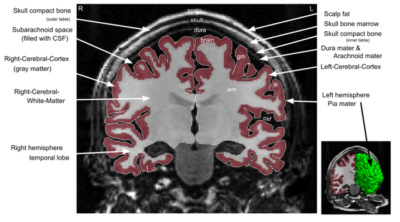
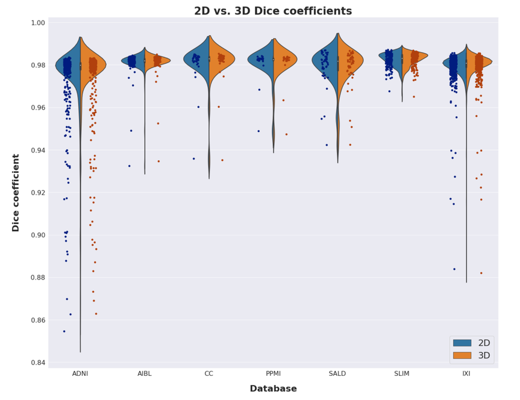
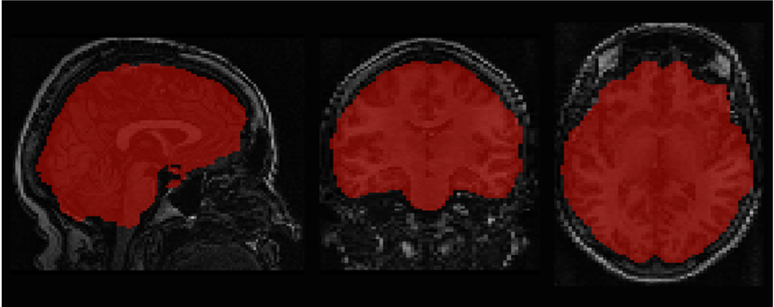

# 2D and 3D U-Nets for skull stripping in a large and heterogeneous set of head MRI using fastai"

This paper presents two novel skull stripping methods for brain MRI images using 2D and 3D convolutional neural networks (CNNs). Skull stripping, also known as brain extraction, is the process of removing non-brain tissue from MRI head scans, which is a crucial preprocessing step for many brain imaging applications.
 
<table align="center">
  <tr><td></td></tr>
  <tr><td align="center"><i>Anatomy of the head related to the brain extraction task. A coronal slice from a 3D T1-weighted (T1w) MRI recording from the head showing the different anatomical structures relevant to the segmentation task of skull stripping or brain extraction (data from [5]). Fully automated segmentation of brain (ribbon) including gray matter (gm) and white matter (wm) of the left and right hemisphere and the outer pial boundary of the brain (white continuous tracing and the surface rendering in the small insert) was performed using Freesurfer v.7.1.1. CFS = cerebrospinal fluid.</i></td></tr>
</table>
 

## Key Aspects of the Research

### Dataset and Methodology
- The models were trained on a large, heterogeneous collection of 2,777 clinical 3D T1-weighted MRI images from 1,681 healthy subjects.
- Data was sourced from seven different repositories: ADNI, AIBL, IXI, PPMI, SLIM, Calgary-Campinas, and SALD.
- Ground truth masks were automatically generated using tools from FMRIB Software Library (FSL).
- The preprocessing pipeline included: DICOM to NIfTI conversion, reorientation to MNI152 standard template, bias field correction using FAST, linear and nonlinear registration to standard MNI152 space, and resampling to isotropic 1.0×1.0×1.0 mm³ voxel size.

### Model Architecture and Training
- Two models were developed:
  1. A 2D U-Net using a ResNet-34 pre-trained on ImageNet as encoder and PixelShuffle with ICNR initialization for upsampling (decoder), implemented in fastai v1.
  2. A 3D U-Net implemented using MONAI and trained using a custom extension of fastai library for 3D images.
- Data augmentation techniques included random rotation and scaling.
- The 2D approach processed axial cross-sections of the 3D volumes.

### Evaluation
- Models were tested on 927 images from 324 subjects set aside from the training data repositories and on the independent IXI dataset (n = 556).
- Performance metrics included Dice coefficient, Jaccard index, and Hausdorff distance.
- Both models achieved mean Dice scores higher than 0.978 and Jaccard indices higher than 0.957 on all test sets.
- The 3D model was significantly faster, making predictions in approximately 1.4s compared to 12.4s for the 2D model on a standard CPU.
- Some robustness advantages over traditional methods were observed, particularly in cases where FSL failed.

### Results and Implications
- Both models performed similarly in terms of accuracy metrics, with the 3D model being considerably faster.
- The models maintained high performance even on images with bias field issues, demonstrating robustness.
- The authors note that once a certain threshold of accuracy is reached, robustness to variation becomes more important than increased accuracy at reproducing ground truth labels.
   
    <table align="center">
      <tr><td></td></tr>
      <tr><td align="center"><i>Violin plot of the Dice scores obtained by our models on the test dataset. Column names at the bottom of the plot refer to their database sources. The dots along the lower tail of the DSC distributions indicate outliers.</i></td></tr>
    </table>
   
- The CNN-based approaches showed some robustness advantages over traditional skull stripping methods like FSL.
 
  <table align="center">
  <tr><td></td></tr>
  <tr><td align="center"><i>Predicition on a T1w image.</i></td></tr>
  </table>
 

### Future Work
- Further investigation of the models' robustness to pathological variation in input images is needed.
- Adding an automated MRI quality control system based on MRIQC would be beneficial.
- Integration of the models into established clinical workflows for real-world testing is mentioned as a crucial step for bringing deep learning research into practice.

The fast and accurate skull stripping methods developed in this work can potentially form a useful component of brain MRI analysis pipelines, significantly speeding up larger image processing workflows.
---
Publications:
1. 2D and 3D U-Nets for skull stripping in a large and heterogeneous set of head MRI using fastai,
S. Kaliyugarasan, M. Kociński, A. Lundervold, A. S. Lundervold, for the Alzheimer’s Disease
Neuroimaging Initiative and for the Australian Imaging Biomarkers and Lifestyle flagship study of ageing,
str. 2Norsk IKT-konferanse for forskning og utdanning, 2020 ([link](https://www.dropbox.com/scl/fi/kbdc5xrph9snduhxuz7ew/Meeting-notes-Revision-skullstrip-NIK2020.paper?rlkey=eyo93bnex5yxfcseptu219vs5&dl=0)).
